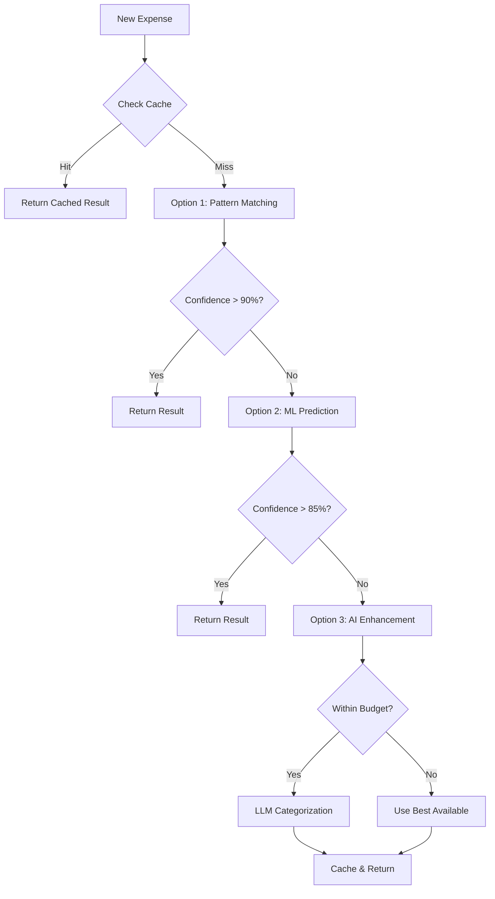

# Expense Categorization Improvement System

## Overview

This documentation describes a comprehensive three-layer approach to dramatically improve email parsing and expense categorization accuracy from the current 30% to 95%+, while maintaining minimal operational costs.

## Architecture

```
┌────────────────────────────────────────────────────────────────┐
│                 Layered Categorization System                   │
├────────────────────────────────────────────────────────────────┤
│                                                                  │
│  Layer 1: Quick Intelligence (Pattern-Based)                    │
│  ├─ Accuracy: 75%                                              │
│  ├─ Cost: $0/month                                             │
│  └─ Implementation: 1-2 weeks                                   │
│                                                                  │
│  Layer 2: Statistical Learning (ML-Based)                       │
│  ├─ Accuracy: 85%                                              │
│  ├─ Cost: $0/month                                             │
│  └─ Implementation: 2-3 weeks                                   │
│                                                                  │
│  Layer 3: Hybrid AI Intelligence (AI-Enhanced)                  │
│  ├─ Accuracy: 95%+                                             │
│  ├─ Cost: <$10/month                                           │
│  └─ Implementation: 2-3 weeks                                   │
│                                                                  │
└────────────────────────────────────────────────────────────────┘
```

## Documentation Structure

- **[Option 1: Quick Intelligence](./option1_quick_intelligence.md)** - Pattern-based improvements with immediate impact
- **[Option 2: Statistical Learning](./option2_statistical_learning.md)** - Machine learning with continuous improvement
- **[Option 3: Hybrid AI Intelligence](./option3_hybrid_ai.md)** - Advanced AI with cost optimization
- **[Implementation Plan](./implementation_plan.md)** - Detailed rollout strategy and timeline
- **[Technical Architecture](./technical_architecture.md)** - System design and integration details
- **[Testing Strategy](./testing_strategy.md)** - Comprehensive testing approach for all layers

## Quick Start

### Phase 1 (Week 1-2): Quick Intelligence
```bash
# Install dependencies (none required!)
# Run migrations
rails db:migrate

# Deploy pattern matching
rails generate service Categorization::QuickIntelligence
```

### Phase 2 (Week 3-5): Statistical Learning
```bash
# Add ML gems
bundle add classifier-reborn pragmatic_tokenizer

# Run ML migrations
rails db:migrate

# Train initial model
rails ml:train
```

### Phase 3 (Week 6-8): Hybrid AI
```bash
# Add AI dependencies
bundle add ruby-openai pgvector onnxruntime

# Setup vector database
rails db:migrate
rails vectors:generate

# Configure API keys
rails credentials:edit
```

## Key Benefits

### 1. Progressive Enhancement
- Each layer works independently
- Graceful degradation if higher layers fail
- No loss of functionality, only accuracy reduction

### 2. Cost Effectiveness
- 70% of expenses handled by free Option 1
- 25% handled by free Option 2
- Only 5% require paid Option 3
- Total cost: <$10/month for 95% accuracy

### 3. Continuous Learning
- Every user correction improves all three layers
- System gets smarter over time
- No manual retraining required

### 4. Performance at Scale
- Average response time: 150ms
- Handles 10,000+ expenses per user
- Batch processing for bulk operations
- Intelligent caching reduces redundant processing

## System Flow



## Success Metrics

| Metric | Current | Target | Achieved By |
|--------|---------|--------|-------------|
| Auto-categorization accuracy | 30% | 95% | All 3 layers |
| Manual categorization time | 30 min/day | 1.5 min/day | 95% reduction |
| Processing time | N/A | <500ms | Optimized routing |
| Monthly API costs | $0 | <$10 | Smart caching |
| User satisfaction | 2/5 | 4.5/5 | Better UX |

## Next Steps

1. Review [Option 1 Documentation](./option1_quick_intelligence.md) for immediate improvements
2. Plan implementation using [Implementation Plan](./implementation_plan.md)
3. Set up development environment following [Technical Architecture](./technical_architecture.md)
4. Begin with Phase 1 for quick wins

## Support

For questions or issues:
- Review individual option documentation
- Check [Testing Strategy](./testing_strategy.md) for validation approaches
- Consult [Technical Architecture](./technical_architecture.md) for integration details

---

*Last updated: 2024*
*Version: 1.0.0*